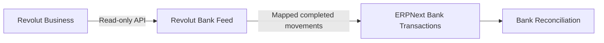

<div align="center">


# Revolut Bank Feed

### Your Revolut transactions. Inside ERPNext.

An **unofficial, read-only** Revolut Business integration for Frappe & ERPNext v16.

[](https://github.com/frappe/erpnext)
[](pyproject.toml)
[](LICENSE)
[](docs/verification.md)

[Connect an account](docs/browser-setup.md) · [Deploy with Docker](docker/INTEGRATE-EXISTING-DEPLOYMENT.md) · [Explore the docs](#documentation) · [Report an issue](https://github.com/GreatWharf/erpnext_revolut/issues)

</div>

---

> **Unofficial integration.** This independent community project is not affiliated with, endorsed by, or supported by Revolut, Frappe, or ERPNext. Product names and trademarks belong to their respective owners.

Bring completed Revolut Business movements into ERPNext as **Bank Transactions**, ready for the standard Bank Reconciliation workflow. Set up the connection in your browser, map accounts by currency, and let the scheduler keep the feed up to date.

| Connect | Keep in sync | Stay in control |
| :--- | :--- | :--- |
| Guided setup inside ERPNext | Automatic polling every 15 minutes | READ-only Revolut authorization |
| Server-generated certificates | Historical imports and recovery | Explicit Company and currency mapping |
| Multiple business connections | Sync logs and source history | Review changed transactions before applying them |



**Your accounting stays deliberate.** The connector does not initiate payments or create Payment Entries, Journal Entries, transfers, counterparties, or GL Entries. Optional imports include expenses, private receipts, account balances, FX quotes, and accounting reference data.

> **Release status: v0.4.0 — release candidate.** Local unit/mock tests and packaging were validated during authoring. Live ERPNext installation, browser setup, Docker deployment, and Revolut authorization still require validation. See the [verification report](docs/verification.md) and [staging acceptance checklist](docs/acceptance.md) before connecting production accounting.

## From repository to connected account

1. **Include the app in your ERPNext image.** Add this public repository to your existing custom-app build and retain every app already installed on your site.
2. **Install and migrate the site.** Deploy the image to all Frappe services; install `revolut_bank_feed`, run migration, and verify the scheduler and `long` worker.
3. **Open Connect Revolut.** Visit `/desk/revolut-setup` as a System Manager and choose your Company, environment, and import start date.
4. **Authorize read-only access.** Generate a certificate in the wizard, register its public certificate in Revolut Business, and complete the guided consent flow.
5. **Map, verify, and sync.** Match Revolut accounts to ERPNext Bank Accounts, compare a small import with your statement, then enable routine syncing.

The app runs inside your existing ERPNext deployment. It needs no separate application server. Credentials are configured after installation, never baked into your image.

## Documentation

| Guide | What you will find |
| :--- | :--- |
| [Existing Docker deployment](docker/INTEGRATE-EXISTING-DEPLOYMENT.md) | Add the app to your current image and migration workflow |
| [Browser setup](docs/browser-setup.md) | Certificates, consent, account mapping, and daily controls |
| [Data coverage](docs/read-only-coverage.md) | Transactions, expenses, receipts, balances, and FX |
| [Data model](docs/data-model.md) | Identity, fees, revisions, and reconciliation rules |
| [Operations](docs/operations.md) | Backfill, monitoring, recovery, upgrades, and uninstall |
| [Security](docs/security.md) | Credential handling, permissions, and webhook verification |
| [Verification](docs/verification.md) | Checks performed and remaining live validation |
| [Acceptance checklist](docs/acceptance.md) | Validate the integration against your deployment |

## License

Released under the **[MIT License](LICENSE)**. Copyright © 2026 Revolut Bank Feed contributors. See the license for permission and warranty terms.

---

## Easy browser setup

After the app is installed, open **Connect Revolut** from ERPNext's search bar, or visit `/desk/revolut-setup`. The guided flow selects a Company, generates the certificate securely on the server, guides Revolut registration and read-only consent, discovers accounts and offers matching Bank Account dropdowns. Start, pause, sync, backfill and review status from the same page. No terminal commands are needed for daily use.

**Use your existing custom Docker workflow.** Add this app at image-build time and run its idempotent site initializer in your deployment/migration stage. No GitHub Actions or manual container session is required. Start with [Integrate an existing deployment](docker/INTEGRATE-EXISTING-DEPLOYMENT.md); the exact patch depends on your Dockerfile and Compose configuration. [Browser setup](docs/browser-setup.md) follows deployment.

This **0.4 release targets v16**, including Python 3.14 and the `/desk` route. See the [v16 compatibility notes](docs/v16-compatibility.md).

## Expanded read-only imports (0.3)

The frontend now offers **Choose extra data**: expenses with split/tax/label details, private receipts, daily FX quotes and accounting reference lists. All accounts and balances are mirrored hourly. Expenses link to bank source records and can be associated with an existing invoice/claim; no automatic reimbursement or GL posting is created. FX quotes can explicitly populate standard Currency Exchange without replacing existing rates.

Routine transaction polling now overlaps **one hour**, with the broader **seven-day correction check once daily**. The rotating historical audit remains. See the [complete coverage and efficiency guide](docs/read-only-coverage.md) for schedules, expense limitations, quote semantics and upgrades.

## What is included

- Separate encrypted credentials for multiple Revolut Business connections; one Company per connection, with multiple Companies across connections.
- Explicit account/currency → company Bank Account mapping, validated against its bank ledger currency.
- Fresh RS256 client assertions, authorization-code exchange, automatic token refresh and connection-wide locking.
- READ-only consent and a transport allowlist: approved GET account, transaction, expense/receipt, FX and accounting-reference endpoints; the only POST is OAuth `/auth/token`.
- Stable transaction/leg identities, database uniqueness, per-transaction commits and resumable page checkpoints.
- Incremental polling every 15 minutes, one-hour overlap and daily recent-history checks, historical backfill, pending rechecks and a rotating historical audit.
- Manual Sync Now, account discovery, source review, sync logs and an optional signed v2 webhook inbox.
- Created/pending observation; completed import; explicit review of changes/reversions; independent refunds and FX legs.
- Tests, optional GitHub workflows, custom Docker image configuration, deployment/security/operations guides.

## Data flow and safeguards

```text
Revolut READ API → reduced source history → account/currency map
                                           ↓
                                ERPNext Bank Transaction
                                           ↓
                                Bank Reconciliation
```

Only `completed` movements become bank rows. Reconciliation remains an accounting action in ERPNext. If an imported movement changes, the source record and existing bank rows are marked for review. New reconciliation allocations are blocked until the conflict is resolved; removing links is allowed. Review and Apply fetches current bank evidence, checks that links are removed, then cancels/replaces the affected statement rows while retaining their originals. A reversal does not automatically generate an opposite-sign movement or undo vouchers.

The account ID is part of each identity because Revolut's FX example uses the same leg ID on two accounts. The environment, currency, transaction ID and leg ID also participate. A separate revision key enforces one Bank Transaction per source-leg version. One source account/currency and one ERPNext Bank Account can each have only one mapping on a site, preventing duplicated feeds through multiple certificates. Reauthorizing the existing connection preserves identity.

**Fees:** the public schema describes `fee` but does not unambiguously establish whether `amount` is net of that fee for all transaction types. The default policy is **Review**. For each map, compare API data with an official statement and choose **Amount includes fee** or **Deduct fee from amount**. The app retains the reported fee separately; it never invents an accounting fee voucher. See [money and state rules](docs/data-model.md).

## Requirements

- Frappe **16.x** and ERPNext **16.x**, MariaDB (upstream v16 guidance: 11.8), Python **3.14.x**, Node **24+** for asset builds, Redis and an RQ worker consuming `long`.
- A running Frappe scheduler, outbound HTTPS to the relevant Revolut API host and accurate server time.
- Revolut Business API access for the Business account. Confirm eligibility/entitlement in your account's API settings; plan names and regional availability can change.
- System Manager access for connector setup. Standard ERPNext roles continue to control Bank Transaction and reconciliation access.
- HTTPS site URL for guided browser setup and OAuth return. Optional webhooks additionally require a publicly reachable endpoint; polling needs no incoming webhook access.

Installation and migration reject other Frappe/ERPNext major versions and non-MariaDB sites. This release targets v16; use the separate 0.3 archive for v15.

## Alternative: manual Bench installation

Publish the repository to your GitHub organization, then run in your existing v16 bench. Replace the sample URL and site name:

```bash
bench get-app https://github.com/GreatWharf/erpnext_revolut --branch main
bench --site erp.example.com backup --with-files
bench --site erp.example.com install-app revolut_bank_feed
bench --site erp.example.com migrate
bench build --app revolut_bank_feed
bench --site erp.example.com enable-scheduler
bench restart
```

For an unpacked local checkout, first initialize and commit it as a Git repository (`git init`, `git add .`, `git commit`), then use its absolute path with `bench get-app`. Do not copy Python files into ERPNext core. Frappe and ERPNext are provided by the bench, not installed from PyPI as dependencies of this package.

Use the Awesomebar to open **Revolut Connection**, **Revolut Account Map**, **Revolut Source Transaction** or **Revolut Sync Log**. No workspace customization is required.

## Install in Docker

Use a custom image containing ERPNext and this app, deployed to **all** Frappe services. Installing into only a running backend container will be lost when that container is recreated and leaves workers without the app.

The complete instructions are in [Docker installation](docker/README.md), including the current official BuildKit secret-based `apps.json` method. An example app list and Compose override are included. Keep certificate/private-key files out of build contexts and images.

## Configure Revolut authentication

This uses the **Business API**, not the Merchant API or Open Banking API. Start in Sandbox and use separate certificates/connections for Production.

1. Generate an RSA private key and an X.509 certificate on a trusted workstation:

   ```bash
   umask 077
   openssl genrsa -out privatecert.pem 2048
   openssl req -new -x509 -key privatecert.pem -out publiccert.cer -days 365
   ```

2. In Revolut Business → APIs → Business API, add the **public** certificate. Register an HTTPS OAuth redirect URI on a domain you control; record its Client ID. The app uses a manual authorization-code exchange, so the redirect page needs no special callback handler. Use a page that does not load analytics or third-party assets and does not record query strings. A simple static page is suitable. Do not point it at the webhook endpoint.
3. Create a **Revolut Connection** in ERPNext. Set Company, environment, Client ID, the exact redirect URI, and its hostname in Issuer (for example, `erp.example.com`). Set Historical From to the earliest creation date you want to import, in UTC. Keep Enabled off and save.
4. Choose **Authorization → Load Private Key** and select `privatecert.pem`. It is read in the browser and transmitted over your ERPNext HTTPS session directly to an encrypted Password field; no File attachment is created. Do not upload the private key to Revolut or commit it to Git.
5. Choose **Authorization → Authorize READ Access**. Open the generated consent link and confirm it requests **READ only**. Complete Revolut's authorization. Copy the `code` parameter from the redirect URL into **Exchange Authorization Code** promptly; Revolut gives it a two-minute lifetime.
6. The app stores the returned tokens encrypted and generates a new short-lived assertion whenever refresh is needed. Tokens are refreshed ahead of expiration and once after an API 401. No access/refresh token needs to be copied into configuration or environment variables.

The issuer is the redirect hostname, the subject is Client ID and the audience is `https://revolut.com` in both environments. Tokens normally last about 40 minutes; the app uses the returned `expires_in`. Refresh responses that omit a refresh token retain the existing one. Token expiry and certificate expiry are distinct: renew the certificate and reauthorize before its expiry.

If you supplied a code obtained through a different authorization URL, the app cannot prove its permissions when Revolut omits `scope` from the response. Always use the supplied READ link. If a response reports broader permissions, it is rejected; revoke that consent in Revolut. The HTTP client still exposes no payment/write routes.

## Map accounts and run the first sync

1. While the connection remains disabled, choose **Discover Accounts** to read Revolut account IDs and currencies.
2. In ERPNext create the Bank, a Bank ledger in the correct currency, and a Bank Account with **Is Company Account** enabled and the correct Company and ledger.
3. Create a **Revolut Account Map** for each account/currency. Copy the Revolut account ID; select the ERPNext Bank Account; choose the statement-date timezone. The default is UTC, so explicitly choose `Europe/London` if appropriate to your statement.
4. Keep the default fee policy Review until you verify fee semantics. For accounts you deliberately exclude, create the mapping disabled. A transaction containing an unknown account/currency is held for review rather than silently losing that leg.
5. Enable and save the connection. Choose **Sync Now**, then open **Sync Logs**. The initial poll catches up from Historical From in configurable windows. It advances one window each run; additional Sync Now calls can speed up catch-up.
6. Compare a small imported period with your Revolut statement, including opening/closing balances, signs, dates, fees and FX. Then use standard ERPNext Bank Reconciliation.

Disable and save a connection before modifying its settings or mappings. A currently running sync holds a lock; wait for it to finish before editing. Refresh the form before saving if token/sync status changed. Account, currency, Company and timezone bindings cannot be silently moved after creation. An unused mapping can be deleted while its connection is disabled; mappings with source legs remain for audit. Disabling a map pauses its processing and preserves its existing bank rows. Re-enable and backfill the paused period to catch up.

For multiple Companies, create a separate connection for each Company's Business account. Do not reuse a single real account across Companies or create a second active feed alongside Plaid/CSV imports for the same period. This connector deduplicates its own source identities, not untagged historical CSV/Plaid rows.

## Historical backfill and scheduled recovery

- **Sync Now** queues the same bounded job the scheduler uses. It does not block a web request while history downloads.
- **Historical Backfill** accepts From and Through dates (Through is inclusive, both UTC). It processes a separate persisted range without rewinding the normal poll cursor. Move Historical From earlier before requesting an earlier range. Only one backfill runs per connection at a time.
- Polling defaults to **15 minutes**, **7-day catch-up windows** and a **60-minute overlap**. A separate daily correction scan covers the latest seven days. The poll cursor follows creation time, not update time.
- Pending/created source records are re-fetched individually in batches of 50, oldest checked first.
- An audit revisits **30 days of history per day** by default, cycling from Historical From to the present. A one-year history therefore takes roughly 13 successful daily audit runs to revisit fully. Increase the audit window if traffic permits; if you disable audits, old completed reversals depend on webhooks or a manual backfill.
- Webhooks trigger an immediate queued job, with periodic draining of the durable inbox as a fallback. Independent phases allow polling to proceed even if one event fails.
- Pages checkpoint only after their imports commit. A restart resumes the frozen window; replayed transactions remain idempotent. Retries have network timeouts, backoff and rate-limit handling. Jobs use a 600-second work budget and a 900-second RQ timeout.

See [operations and troubleshooting](docs/operations.md) for monitoring, recovery and limitations.

## Optional webhooks

The endpoint supports current Business API v2 `TransactionCreated` and `TransactionStateChanged` events. Enable polling regardless.

**Registration requires WRITE access at Revolut.** This app never requests or uses that scope, and cannot register, rotate or delete webhooks itself. If you require no WRITE permission anywhere, use polling only. Otherwise arrange webhook provisioning separately with a distinct setup credential/admin process, then retain only the READ connection here. Do not paste a setup token into this app.

1. Copy **Webhook URL** from the saved connection. It contains a random routing key and must use your public HTTPS hostname. Configure Frappe `host_name` correctly before saving if necessary.
2. Using your separately authorized provisioning process, create a Revolut webhook with the copied URL and events `TransactionCreated` and `TransactionStateChanged`. The current API is `POST /api/1.0/webhooks` on the relevant Business API host. No provisioning script is included because it would require write authorization outside this connector's purpose.
3. Save the returned signing secret in **Webhook Secret**, check **Webhook Enabled**, then enable the connection. If the connection is already enabled, first disable/save it to edit these settings.
4. Test with a Sandbox event and inspect **Revolut Webhook Event**. Pending/Retry entries are durable; Done means the transaction was fetched and processed. The payload itself is not treated as authoritative transaction data.

Verification signs the unmodified request bytes using HMAC-SHA256 over `v1.<timestamp>.<body>`, accepts either of the configured current/previous secrets and validates a five-minute delivery-time tolerance. It handles comma-separated signatures, duplicate deliveries and out-of-order events. The routing key alone grants no authority. No global CSRF bypass is used; Revolut must send requests without ERPNext session cookies. During secret rotation, temporarily keep the old secret in Previous Webhook Secret, then remove it after the overlap expires.

Configure the reverse proxy to preserve body bytes and signature headers, enforce HTTPS and request-size/rate limits, and avoid logging request bodies, Authorization headers or query strings on authorization/webhook routes. See [security](docs/security.md).

## Tests and development

Pure/client/persistence tests run without Frappe or bank access:

```bash
python -m venv .venv
. .venv/bin/activate
python -m pip install -e '.[test]'
python -m pytest -q
ruff check .
ruff format --check .
python -m build
```

The persistence tests run the real importer against an in-memory boundary; they do not substitute for MariaDB/ERPNext lifecycle tests. On an **isolated v16 test site** with both apps installed:

```bash
bench --site test.localhost set-config allow_tests true
bench --site test.localhost run-tests --app revolut_bank_feed --module revolut_bank_feed.tests.test_integration
```

The supplied GitHub workflows run the unit matrix and can provision a real v16 bench for integration tests. The integration workflow has not been executed in this authoring environment. No test talks to a real Revolut account. See [verification report](docs/verification.md).

## Upgrades and uninstall

Back up the database, files and the site's **encryption_key** before upgrading. Disable connections, drain jobs, deploy the app version to all workers/web processes, run `bench --site SITE migrate` and rebuild assets/restart. For Docker, build and deploy a new immutable custom image instead of updating a running container. Resume only after staging tests and a statement comparison. Keep this app on the v16 line until another major version is explicitly validated.

For uninstall, disable connections and drain queued/running jobs; resolve reviews and export source/revision/leg/log records. Remove webhook registration and revoke the API certificate/consent externally. Then run `bench --site SITE uninstall-app revolut_bank_feed`. Frappe deletes the app's source/configuration DocTypes; standard Bank Transactions remain. The app deliberately leaves its Bank Transaction custom fields so provenance is retained. Removing those fields or source histories weakens duplicate detection on reinstall; do not uninstall/reinstall as a sync reset. See [operations](docs/operations.md#uninstall-and-reinstall).

## Official references

Endpoint/auth/schema behavior was checked against the following official sources on **2026-09-12**. Implementation decisions and unverified items are distinguished in the linked guides.

- [Revolut Business authentication](https://developer.revolut.com/docs/guides/manage-accounts/get-started/make-your-first-api-request)
- [Transaction retrieval, pagination and states](https://developer.revolut.com/docs/guides/manage-accounts/accounts-and-transactions/retrieve-transactions)
- [Business API schema and scopes](https://developer.revolut.com/docs/api/business)
- [Webhook events](https://developer.revolut.com/docs/guides/manage-accounts/webhooks/about-webhooks) and [signature verification](https://developer.revolut.com/docs/guides/manage-accounts/webhooks/verify-the-payload-signature)
- [ERPNext Bank Transaction](https://docs.frappe.io/erpnext/bank-transaction) and [v16 implementation](https://github.com/frappe/erpnext/blob/version-16/erpnext/accounts/doctype/bank_transaction/bank_transaction.py)
- [Frappe background jobs](https://docs.frappe.io/framework/user/en/api/background_jobs) and [v16 password storage](https://github.com/frappe/frappe/blob/version-16/frappe/utils/password.py)
- [Official Docker custom-image build instructions](https://github.com/frappe/frappe_docker/blob/main/docs/02-setup/02-build-setup.md)

License: MIT. See [LICENSE](LICENSE).
